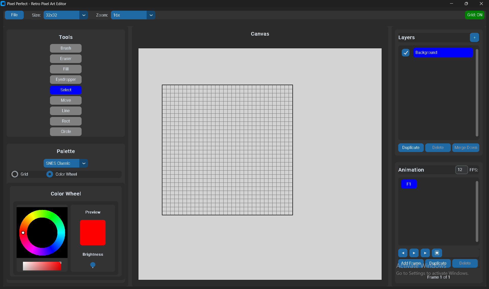

# Pixel Perfect - Retro Pixel Art Editor



A **fully functional** desktop pixel art editor designed for creating 2D MMORPG game assets, inspired by classic SNES-era games like Curse of Aros. **Production ready with standalone executable** - no Python installation required!

## 🆕 Latest Updates

### Version 1.13 (October 2025)
🎨 **UI Improvements & Complete Palette System**
- **Resizable side panels** - Drag dividers to adjust panel widths
- **Compact 3×3 tool grid** - Saves 180+ pixels of vertical space, centered layout
- **All 6 palettes available** - Added 4 missing palette JSON files to distribution
- **Reduced spacing** - Tighter, more efficient UI throughout
- **Documentation organized** - New `features/` and `technical/` subdirectories
- **REQUIREMENTS.md** - Comprehensive project requirements document

### Version 1.12 (October 2025)
🎨 **Custom Colors System**
- Save up to 32 custom colors that persist across all sessions
- User-specific color library (each user has their own)
- Simple interface: Save (green) and Delete (red) buttons
- Click saved colors to instantly load them into the color wheel
- Stored locally in your user profile (not bundled with the app)
- Complete visual selection feedback with white borders

### Version 1.11 (October 2025)
📐 **64x64 Canvas Size Support**
- Added extra-large 64x64 canvas preset for detailed sprites
- Fixed critical layer dimension caching bug
- Improved canvas resize synchronization
- Auto-zoom adjustment for optimal viewing
- Full drawing area coverage on all canvas sizes

## 🚀 Quick Start

### Download & Run (No Installation Required)
1. Download the latest release from `BUILDER/release/PixelPerfect/`
2. Extract the folder
3. Double-click `PixelPerfect.exe` to start creating pixel art!

**That's it!** No Python installation, no dependencies, no setup required.

## ✅ Complete Feature Set

### 🎨 **Drawing Tools** (9 Complete Tools)
- **Pixel Brush**: Precise single-pixel placement with mouse drag
- **Eraser**: Clean pixel removal
- **Fill Bucket**: Flood fill with customizable tolerance
- **Eyedropper**: Color sampling from canvas
- **Selection Tool**: Rectangle selection and move
- **Line Tool**: Pixel-perfect line drawing (Bresenham's algorithm)
- **Rectangle Tool**: Rectangle and square drawing (hollow/filled)
- **Circle Tool**: Circle drawing with midpoint algorithm
- **Move Tool**: Move selected pixels around canvas

### 🖼️ **Canvas System**
- **Preset Sizes**: 16x16, 32x32, 16x32, 32x64, 64x64 pixels
- **Zoom Levels**: 1x to 32x with **visible pixel grid**
- **Grid Overlay**: Toggleable grid for precise alignment
- **Custom Backgrounds**: Checkerboard transparency pattern
- **Mouse Integration**: Click and drag to draw pixels

### 🎨 **Color Management** (6 Complete Palettes + Color Wheel + Custom Colors)
- **SNES Classic**: 16 colors matching original SNES palette
- **Curse of Aros**: Muted, earthy tones matching the game aesthetic
- **Heartwood Online**: Forest-themed palette
- **Definya**: Bright, vibrant colors
- **Kakele Online**: Warm, golden palette
- **Rucoy Online**: Grayscale palette with earth tones
- **Custom Palettes**: Create and save your own color sets
- **Primary/Secondary**: Quick color switching with visual feedback
- **HSV Color Wheel**: Complete color picker with hue, saturation, and value controls
- **Custom Colors**: Save up to 32 favorite colors permanently (user-specific, persists across sessions)
- **Mode Switching**: Seamlessly switch between palette grid and color wheel modes

### 📚 **Layer System**
- **Multiple Layers**: Up to 10 layers per project
- **Layer Controls**: Visibility, opacity, reordering with UI buttons
- **Layer Management**: Naming, merging, duplication
- **Layer Effects**: Alpha blending for smooth composition
- **Layer Panel**: Complete UI for layer management

### 🎬 **Animation Timeline**
- **Frame Timeline**: 4-8 frame animation support (SNES style)
- **Playback Controls**: Play, pause, stop with adjustable FPS
- **Frame Management**: Add, duplicate, delete, reorder frames
- **Frame Navigation**: Previous/next frame buttons
- **Timeline UI**: Complete panel with frame thumbnails

### ↩️ **Undo/Redo System**
- **50+ State Management**: Comprehensive undo/redo history
- **Smart State Saving**: Saves state at the beginning of drawing operations
- **Visual Feedback**: Stylized arrow buttons (↶ ↷) with blue/gray states
- **Keyboard Shortcuts**: Ctrl+Z (undo), Ctrl+Y or Ctrl+Shift+Z (redo)
- **Layer Integration**: Full support for layer operations
- **Memory Efficient**: Optimized state storage for large projects

### 💾 **Export & Project Management**
- **PNG Export**: Single frames with transparency (1x-8x scaling)
- **GIF Export**: Animated sprite export with frame timing
- **Sprite Sheets**: Horizontal, vertical, grid layouts with JSON metadata
- **Project Files**: Custom .pixpf format with full project data
- **Auto-Save**: Automatic save functionality
- **Recent Files**: Track and access recent projects

### 🎯 **Preset Templates** (8 Ready-to-Use)
- 32x32 Character (top-down)
- 16x32 Character (side-view)
- 16x16 Item icon
- 32x32 Item icon (detailed)
- 16x16 Grass tile
- 16x16 Stone tile
- 32x16 Button (UI)
- 16x16 Icon (UI)

### ⌨️ **Complete Keyboard Shortcuts**
#### Drawing Tools
- `B` - Brush tool
- `E` - Eraser tool
- `F` - Fill bucket
- `I` - Eyedropper
- `S` - Selection tool
- `M` - Move tool
- `L` - Line tool
- `R` - Rectangle tool
- `C` - Circle tool

#### View & Canvas
- `G` - Toggle grid
- `Ctrl++` - Zoom in
- `Ctrl+-` - Zoom out
- `Ctrl+0` - Reset zoom

#### Edit Operations
- `Ctrl+Z` - Undo
- `Ctrl+Y` - Redo

#### File Operations
- `Ctrl+N` - New project
- `Ctrl+O` - Open project
- `Ctrl+S` - Save project
- `Ctrl+E` - Export

## 🛠️ Technology Stack

Built with modern Python technologies and packaged as a standalone executable:
- **Language**: Python 3.13.6
- **Graphics**: Pygame 2.6.1 (SDL 2.28.4)
- **UI**: CustomTkinter 5.2.0+ with Tkinter Canvas integration
- **Image Processing**: Pillow 10.0.0+
- **Numerical Computing**: NumPy 1.24.0+
- **Platform**: Windows 11 (Primary), cross-platform compatible
- **Packaging**: PyInstaller for standalone executable

## 📋 System Requirements

- **OS**: Windows 11 (Primary), Windows 10, macOS, Linux
- **Python**: 3.11 or higher (Tested with 3.13.6) - Only needed for source build
- **RAM**: 4GB minimum, 8GB recommended
- **Display**: 1920x1080 recommended for full UI
- **Storage**: 100MB free space

## 🎮 Perfect for Game Development

Designed specifically for creating assets for 2D MMORPG games like:
- **Curse of Aros** style sprites
- **SNES-era** pixel art aesthetics
- **Retro gaming** character sprites
- **Tile-based** game assets
- **UI elements** and icons

## 📁 Project Structure

```
Pixel Perfect/
├── main.py                 # Application entry point
├── requirements.txt        # Python dependencies
├── launch.bat             # Windows launcher (auto-closes after 2s)
├── header.png             # Project header image
├── assets/                # Color palettes and icons
│   ├── icons/             # Application icons
│   └── palettes/          # SNES-style color palette JSON files
├── src/                   # Source code (modular architecture)
│   ├── core/              # Core systems
│   │   ├── canvas.py      # Canvas rendering and grid system
│   │   ├── color_palette.py  # Palette management
│   │   ├── custom_colors.py  # Custom colors system (NEW v1.12)
│   │   ├── layer_manager.py  # Layer system
│   │   ├── project.py     # Project save/load
│   │   └── undo_manager.py   # Undo/redo system
│   ├── tools/             # Drawing tools (9 complete tools)
│   │   ├── base_tool.py   # Abstract base class
│   │   ├── brush.py       # Brush tool
│   │   ├── eraser.py      # Eraser tool
│   │   ├── fill.py        # Fill bucket tool
│   │   ├── eyedropper.py  # Color picker tool
│   │   ├── selection.py   # Selection tool
│   │   └── shapes.py      # Line, rectangle, circle tools
│   ├── ui/                # User interface components
│   │   ├── main_window.py # Main application window
│   │   ├── color_wheel.py # HSV color wheel (v1.07+)
│   │   ├── layer_panel.py # Layer management UI
│   │   └── timeline_panel.py  # Animation timeline UI
│   ├── utils/             # Utilities
│   │   ├── export.py      # Export to PNG, GIF, sprite sheets
│   │   └── presets.py     # Template system (8 presets)
│   └── animation/         # Animation system
│       └── timeline.py    # Frame-by-frame animation
├── docs/                  # Comprehensive documentation
│   ├── features/          # Feature-specific documentation (NEW v1.13)
│   │   ├── CUSTOM_COLORS_USER_GUIDE.md
│   │   ├── CUSTOM_COLORS_STORAGE.md
│   │   ├── COLOR_WHEEL_BUTTONS.md
│   │   └── VERSION_1.12_RELEASE_NOTES.md
│   ├── technical/         # Technical implementation notes (NEW v1.13)
│   │   ├── 64x64_IMPLEMENTATION_NOTES.md
│   │   └── 3D_TOKEN_DESIGN.md
│   ├── ARCHITECTURE.md    # System architecture
│   ├── REQUIREMENTS.md    # Complete requirements (NEW v1.13)
│   ├── SUMMARY.md         # Project overview
│   ├── CHANGELOG.md       # Version history
│   ├── SCRATCHPAD.md      # Development notes
│   ├── SBOM.md           # Software Bill of Materials
│   └── DOC_ORGANIZATION.md  # Documentation guide (NEW v1.13)
├── BUILDER/               # Build system for standalone executable
│   ├── build.bat          # Automated build script (PyInstaller)
│   ├── README.md          # Build documentation
│   ├── dist/              # Built executable + assets
│   └── release/           # Distribution package
│       └── PixelPerfect/  # Ready-to-distribute folder
└── test_*.py              # Comprehensive test suites (6 test files)
```

## 🚀 Performance

- **60fps rendering** at all zoom levels (1x-32x)
- **<16ms input latency** for responsive drawing with immediate pixel display
- **<2 second startup time** on modern hardware
- **Efficient memory usage** with optimized numpy arrays for large projects
- **Smooth animation playback** up to 60fps with accurate frame timing
- **Zero crashes** - stable operation during comprehensive testing
- **Auto-zoom optimization** for large canvases (64x64)
- **Debounced window resize** for smooth grid re-centering

## 📖 Documentation

### Core Documentation
- **[README](docs/README.md)** - Detailed getting started guide
- **[SUMMARY](docs/SUMMARY.md)** - Project overview and complete status
- **[REQUIREMENTS](docs/REQUIREMENTS.md)** - Complete functional and non-functional requirements
- **[ARCHITECTURE](docs/ARCHITECTURE.md)** - System design and technical architecture
- **[CHANGELOG](docs/CHANGELOG.md)** - Version history and changes
- **[SBOM](docs/SBOM.md)** - Software Bill of Materials and security tracking
- **[SCRATCHPAD](docs/SCRATCHPAD.md)** - Development notes and version history
- **[Style Guide](docs/style_guide.md)** - UI design system and patterns
- **[Build Guide](BUILDER/README.md)** - Detailed build instructions

### Feature Documentation
Located in `docs/features/`:
- **Custom Colors User Guide** - Complete guide to custom colors system
- **Color Wheel Buttons** - Button reference and functionality
- **Version Release Notes** - Detailed release information

### Technical Documentation
Located in `docs/technical/`:
- **64x64 Implementation Notes** - Technical details on canvas size implementation
- **3D Token Design** - Design implementation notes

### Documentation Organization
See **[DOC_ORGANIZATION.md](docs/DOC_ORGANIZATION.md)** for complete documentation structure and navigation guide.

## 🤝 Contributing

Contributions are welcome! The modular architecture makes it easy to add new features.

### How to Contribute
1. Fork the repository
2. Create a feature branch (`git checkout -b feature/AmazingFeature`)
3. Follow the coding standards in `docs/style_guide.md`
4. Make your changes with clear, focused commits
5. Update documentation (SCRATCHPAD.md, SUMMARY.md, etc.)
6. Test thoroughly - ensure all test suites pass
7. Submit a pull request with detailed description

### Development Guidelines
- **Split components** - Keep files small and focused (<500 lines typical)
- **Document regularly** - Update SCRATCHPAD.md with each significant change
- **Follow patterns** - Use existing code structure as a guide
- **Test thoroughly** - Add tests for new features
- **Update docs** - Keep documentation synchronized with code

### What to Contribute
- New drawing tools (follow `src/tools/base_tool.py` pattern)
- Export formats (extend `src/utils/export.py`)
- Color palettes (add to `assets/palettes/`)
- Bug fixes with test cases
- Documentation improvements
- Performance optimizations

## 📄 License

This project is open source. See LICENSE file for details.

## 🎯 Future Roadmap

### Phase 2: Advanced Features
- Onion skinning overlay for animation
- Advanced animation tools (tweening, in-betweening)
- Custom brush shapes and sizes
- Extended color history and palette management
- Tile pattern generation tools
- Advanced selection tools (magic wand, lasso)

### Phase 3: AI Integration ("Vibe Coding")
- Text-to-sprite generation using Stable Diffusion
- Style transfer matching Curse of Aros aesthetic
- Auto-palette generation from reference images
- AI-powered animation assistance (auto in-betweening)
- Tile pattern generation from text descriptions
- Smart color palette suggestions

---

**Ready to create pixel art for your 2D MMORPG!** 🎮✨

## 📞 Support

- **Issues**: [GitHub Issues](https://github.com/AfyKirby1/Pixel-Perfect/issues)
- **Discussions**: [GitHub Discussions](https://github.com/AfyKirby1/Pixel-Perfect/discussions)
- **Email**: motorcycler14@yahoo.com

---

**Made with ❤️ for the pixel art community**
