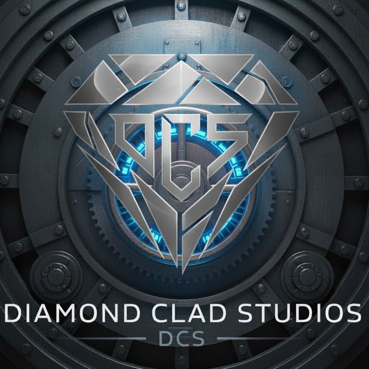
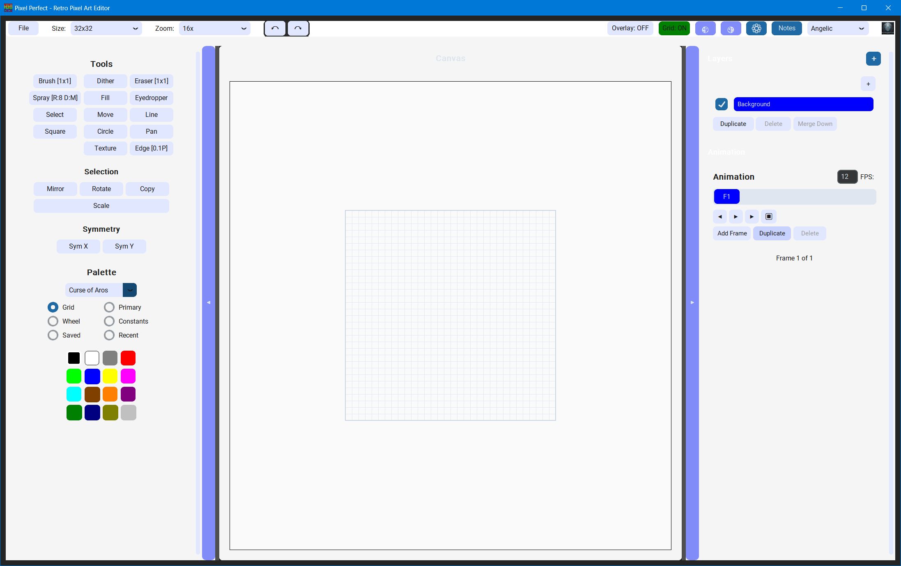

<div align="center">

# 🎨 Pixel Perfect
### Professional Retro Pixel Art Editor



**by Diamond Clad Studios**

**🔧 Core Stack**

[](https://www.python.org/)
[](https://docs.python.org/3/library/tkinter.html)
[](https://github.com/TomSchimansky/CustomTkinter)
[](https://python-pillow.org/)
[](https://numpy.org/)

**💻 Platform & Tools**

[](https://www.microsoft.com/windows)
[](https://pyinstaller.org/)
[](https://git-scm.com/)
[](https://code.visualstudio.com/)

**📦 Build & Deployment**

[](LICENSE)
[](BUILDER/)
[](BUILDER/release/)
[](#)

---

### 📖 Quick Navigation

[🚀 **Quick Start**](#-quick-start) • 
[✨ **Features**](#-complete-feature-set) • 
[💻 **Tech Stack**](#-technology-stack) • 
[📚 **Documentation**](#-documentation) • 
[🤝 **Contributing**](#-contributing) • 
[📄 **License**](#-license) • 
[💰 **Monetization**](#-monetization-strategy) • 
[🎯 **Roadmap**](#-future-roadmap) • 
[🆕 **Latest Updates**](#-latest-updates)

---

</div>

## 🖼️ Screenshots

<div align="center">

<table>
<tr>
<td width="50%">

<p align="center"><em><b>Dark "Basic Grey" Theme</b><br/>Professional workspace with dark color palette</em></p>
</td>
<td width="50%">

<p align="center"><em><b>Light "Angelic" Theme</b><br/>Elegant light interface for comfortable daytime use</em></p>
</td>
</tr>
</table>

</div>

---

## 📝 About

A **fully functional** desktop pixel art editor designed for creating 2D MMORPG game assets, inspired by classic SNES-era games like Curse of Aros. **Production ready with standalone executable** - no Python installation required!

**Perfect for**: Game developers, pixel artists, indie creators, and retro game enthusiasts.

**© 2024-2025 Diamond Clad Studios - All Rights Reserved**

## 🚀 Quick Start

<div align="center">

### ✨ Ready to Create Pixel Art?

**Three Simple Steps to Your First Masterpiece**

</div>

| Step | Action | Details |
|:----:|:------:|:--------|
| **1️⃣** | **Download** | Get `PixelPerfect.exe` from `BUILDER/release/` (29MB) |
| **2️⃣** | **Extract** | Unzip the entire folder (includes EXE + assets + palettes + docs) |
| **3️⃣** | **Create** | Double-click `PixelPerfect.exe` - Start drawing immediately! |

<div align="center">

**✅ No Installation • ✅ No Python Required • ✅ No Dependencies**

</div>

### 🎯 Perfect For

<div align="center">

| 🎮 Game Developers | 🎨 Pixel Artists | 🚀 Indie Creators | 💖 Retro Enthusiasts |
|:------------------:|:----------------:|:-----------------:|:--------------------:|
| SNES-era sprites | Professional tools | Fast asset creation | Authentic experience |
| Tile-based games | Workflow efficiency | Budget-friendly | Classic aesthetics |

</div>

---

<div align="center">

**Developed by Kirby • Designed by Semaj • Diamond Clad Studios**

[⬇️ Download Now](#-installation) • [📖 Read Docs](#-documentation) • [🌟 See Features](#-complete-feature-set)

</div>

## ✅ Complete Feature Set

### 🎨 **Drawing Tools** (10 Complete Tools)
- **Pixel Brush**: Multi-size brush (1x1, 2x2, 3x3) with right-click menu - perfect for both detail work and broad strokes
- **Eraser**: Clean pixel removal
- **Fill Bucket**: Flood fill with customizable tolerance
- **Eyedropper**: Color sampling from canvas (left-click primary, right-click secondary)
- **Selection Tool**: Rectangle selection and move
- **Line Tool**: Pixel-perfect line drawing (Bresenham's algorithm)
- **Rectangle Tool**: Rectangle and square drawing (hollow/filled)
- **Circle Tool**: Circle drawing with midpoint algorithm
- **Move Tool**: Move selected pixels around canvas
- **Pan Tool**: Drag canvas view for navigation on large canvases

### 🖼️ **Canvas System**
- **Preset Sizes**: 16x16, 32x32, 16x32, 32x64, 64x64 pixels
- **Zoom Levels**: 1x to 32x with **visible pixel grid**
- **Grid Overlay**: Toggleable grid for precise alignment
- **Custom Backgrounds**: Checkerboard transparency pattern
- **Mouse Integration**: Click and drag to draw pixels

### 🎨 **Color Management** (7 Complete Palettes + 5 View Modes + Custom & Saved Colors)
- **7 Game-Inspired Palettes**:
- **SNES Classic**: 16 colors matching original SNES palette
  - **Old School RuneScape**: Classic OSRS color palette for authentic retro MMORPG sprites
- **Curse of Aros**: Muted, earthy tones matching the game aesthetic
- **Heartwood Online**: Forest-themed palette
- **Definya**: Bright, vibrant colors
- **Kakele Online**: Warm, golden palette
- **Rucoy Online**: Grayscale palette with earth tones
- **5 Palette View Modes**:
  - **Grid View**: Full palette in 4-column grid (auto-switches when changing palettes)
  - **Primary Colors**: 8 main colors + 24 variations per color
  - **Color Wheel**: Full HSV color picker with editable RGB values (type exact numbers!)
  - **Constants**: Shows only colors actively used on canvas (auto-updates)
  - **Saved Colors** ⭐NEW: 24-slot personal palette with export/import
- **Saved Colors System**: Personal color palette (stored locally, not in git)
  - Click empty slots (+) to save current color
  - Click filled slots to load saved colors
  - Export/Import color sets to share with others
  - Clear All button with confirmation
  - Persists in AppData - your colors stay with you!
- **Custom Colors**: Save up to 32 favorite colors permanently (user-specific, persists across sessions)
- **Editable RGB Values**: Type exact R, G, B values (0-255) in color wheel for precision
- **Primary/Secondary**: Quick color switching with visual feedback (white/gray borders)
- **⚡ INSTANT Switching**: All view modes load instantly (<10ms, 50-100× faster!)
- **Tooltips**: Hover hints for every color and control element

### ✂️ **Selection & Move Operations** (5 Pixel Manipulation Tools + Smart Move System)
- **Selection Tool**: Rectangle selection with marching ants
- **Move Tool** 🌟NEW: Smart two-phase non-destructive move system
  - **First pickup**: Clears original pixels (move, not copy)
  - **Adjustments**: Unlimited repositioning with background preservation
  - **Result**: Move pixels over others without destroying underlying content!
- **Mirror**: Flip selected pixels horizontally
- **Rotate**: Rotate selected pixels 90° clockwise
- **Copy**: Copy and paste selected pixels anywhere on canvas
- **Scale**: Interactive scaling with corner/edge handles (scipy or numpy fallback)

### 📚 **Layer System**
- **Multiple Layers**: Up to 10 layers per project
- **Layer Controls**: Visibility, opacity, reordering with UI buttons
- **Layer Management**: Naming, merging, duplication
- **Layer Effects**: Alpha blending for smooth composition
- **Layer Panel**: Complete UI for layer management

### 🎬 **Animation Timeline**
- **Frame Timeline**: 4-8 frame animation support (SNES style)
- **Playback Controls**: Play, pause, stop with adjustable FPS
- **Frame Management**: Add, duplicate, delete, reorder frames
- **Frame Navigation**: Previous/next frame buttons
- **Timeline UI**: Complete panel with frame thumbnails

### ↩️ **Undo/Redo System**
- **50+ State Management**: Comprehensive undo/redo history
- **Smart State Saving**: Saves state at the beginning of drawing operations
- **Visual Feedback**: Stylized arrow buttons (↶ ↷) with blue/gray states
- **Keyboard Shortcuts**: Ctrl+Z (undo), Ctrl+Y or Ctrl+Shift+Z (redo)
- **Layer Integration**: Full support for layer operations
- **Memory Efficient**: Optimized state storage for large projects

### 💾 **Export & Project Management**
- **PNG Export**: Single frames with transparency (1x-8x scaling)
- **PNG Import**: Load PNG files directly into canvas (auto-scales to fit)
- **GIF Export**: Animated sprite export with frame timing
- **Sprite Sheets**: Horizontal, vertical, grid layouts with JSON metadata
- **Project Files**: Custom .pixpf format with full project data ([format documentation](docs/features/PIXPF_FORMAT.md))
- **File Association**: Register .pixpf extension to open projects by double-clicking
- **Auto-Save**: Automatic save functionality
- **Recent Files**: Track and access recent projects

### 🎯 **Preset Templates** (8 Ready-to-Use)
- 32x32 Character (top-down)
- 16x32 Character (side-view)
- 16x16 Item icon
- 32x32 Item icon (detailed)
- 16x16 Grass tile
- 16x16 Stone tile
- 32x16 Button (UI)
- 16x16 Icon (UI)

### 🎨 **UI & UX Features**
- **⚡ Lightning Fast**: Instant view switching (50-100× faster with pre-rendered views!)
- **Theme System**: Real-time theme switching (Basic Grey, Angelic themes)
- **Collapsible Panels**: Hide/show left and right panels for maximum canvas space
- **Resizable Panels**: Drag dividers to adjust panel widths (left: 520px, right: 500px)
- **Smooth Panel Transitions**: Optimized divider dragging with outline-only resize
- **Tooltips**: Comprehensive hover hints for every button and control
- **Grid Overlay**: Toggle grid lines on top of pixels for dense artwork
- **Custom Icon**: Diamond Clad Studios brand integration with colorful pixel logo
- **Keyboard Cursor Feedback**: Visual tool cursors that follow the mouse
- **Professional Styling**: Blue theme with rounded buttons and clean UI
- **Buttery Smooth**: Visibility toggling for instant palette view changes

### ⌨️ **Complete Keyboard Shortcuts**
#### Drawing Tools
- `B` - Brush tool
- `E` - Eraser tool
- `F` - Fill bucket
- `I` - Eyedropper
- `S` - Selection tool
- `M` - Move tool
- `P` - Pan tool
- `L` - Line tool
- `R` - Rectangle tool
- `C` - Circle tool

#### View & Canvas
- `G` - Toggle grid
- `Ctrl++` - Zoom in
- `Ctrl+-` - Zoom out
- `Ctrl+0` - Reset zoom

#### Edit Operations
- `Ctrl+Z` - Undo
- `Ctrl+Y` - Redo

#### File Operations
- `Ctrl+N` - New project
- `Ctrl+O` - Open project
- `Ctrl+S` - Save project
- `Ctrl+E` - Export

## 🛠️ Technology Stack

Built with modern Python technologies and packaged as a standalone executable:
- **Language**: Python 3.13.6
- **Graphics**: Pygame 2.6.1 (SDL 2.28.4)
- **UI**: CustomTkinter 5.2.0+ with Tkinter Canvas integration
- **Image Processing**: Pillow 10.0.0+
- **Numerical Computing**: NumPy 1.24.0+
- **Platform**: Windows 11 (Primary), cross-platform compatible
- **Packaging**: PyInstaller for standalone executable

## 📋 System Requirements

- **OS**: Windows 11 (Primary), Windows 10, macOS, Linux
- **Python**: 3.11 or higher (Tested with 3.13.6) - Only needed for source build
- **RAM**: 4GB minimum, 8GB recommended
- **Display**: 1920x1080 recommended for full UI
- **Storage**: 100MB free space

## 🎮 Perfect for Game Development

Designed specifically for creating assets for 2D MMORPG games like:
- **Curse of Aros** style sprites
- **SNES-era** pixel art aesthetics
- **Retro gaming** character sprites
- **Tile-based** game assets
- **UI elements** and icons

## 📁 Project Structure

```
Pixel Perfect/
├── main.py                 # Application entry point
├── requirements.txt        # Python dependencies
├── launch.bat             # Windows launcher (auto-closes after 2s)
├── header.png             # Project header image
├── assets/                # Color palettes and icons
│   ├── icons/             # Application icons
│   └── palettes/          # SNES-style color palette JSON files
├── src/                   # Source code (modular architecture)
│   ├── core/              # Core systems
│   │   ├── canvas.py      # Canvas rendering and grid system
│   │   ├── color_palette.py  # Palette management
│   │   ├── custom_colors.py  # Custom colors system (NEW v1.12)
│   │   ├── layer_manager.py  # Layer system
│   │   ├── project.py     # Project save/load
│   │   └── undo_manager.py   # Undo/redo system
│   ├── tools/             # Drawing tools (9 complete tools)
│   │   ├── base_tool.py   # Abstract base class
│   │   ├── brush.py       # Brush tool
│   │   ├── eraser.py      # Eraser tool
│   │   ├── fill.py        # Fill bucket tool
│   │   ├── eyedropper.py  # Color picker tool
│   │   ├── selection.py   # Selection tool
│   │   └── shapes.py      # Line, rectangle, circle tools
│   ├── ui/                # User interface components
│   │   ├── main_window.py # Main application window
│   │   ├── color_wheel.py # HSV color wheel (v1.07+)
│   │   ├── layer_panel.py # Layer management UI
│   │   └── timeline_panel.py  # Animation timeline UI
│   ├── utils/             # Utilities
│   │   ├── export.py      # Export to PNG, GIF, sprite sheets
│   │   └── presets.py     # Template system (8 presets)
│   └── animation/         # Animation system
│       └── timeline.py    # Frame-by-frame animation
├── docs/                  # Comprehensive documentation
│   ├── features/          # Feature-specific documentation (NEW v1.13)
│   │   ├── CUSTOM_COLORS_USER_GUIDE.md
│   │   ├── CUSTOM_COLORS_STORAGE.md
│   │   ├── COLOR_WHEEL_BUTTONS.md
│   │   └── VERSION_1.12_RELEASE_NOTES.md
│   ├── technical/         # Technical implementation notes (NEW v1.13)
│   │   ├── 64x64_IMPLEMENTATION_NOTES.md
│   │   └── 3D_TOKEN_DESIGN.md
│   ├── ARCHITECTURE.md    # System architecture
│   ├── REQUIREMENTS.md    # Complete requirements (NEW v1.13)
│   ├── SUMMARY.md         # Project overview
│   ├── CHANGELOG.md       # Version history
│   ├── SCRATCHPAD.md      # Development notes
│   ├── SBOM.md           # Software Bill of Materials
│   └── DOC_ORGANIZATION.md  # Documentation guide (NEW v1.13)
├── BUILDER/               # Build system for standalone executable
│   ├── build.bat          # Automated build script (PyInstaller)
│   ├── README.md          # Build documentation
│   ├── dist/              # Built executable + assets
│   └── release/           # Distribution package
│       └── PixelPerfect/  # Ready-to-distribute folder
└── test_*.py              # Comprehensive test suites (6 test files)
```

## 🚀 Performance

- **60fps rendering** at all zoom levels (1x-32x)
- **<16ms input latency** for responsive drawing with immediate pixel display
- **<2 second startup time** on modern hardware
- **Efficient memory usage** with optimized numpy arrays for large projects
- **Smooth animation playback** up to 60fps with accurate frame timing
- **Zero crashes** - stable operation during comprehensive testing
- **Auto-zoom optimization** for large canvases (64x64)
- **Debounced window resize** for smooth grid re-centering

## 📖 Documentation

### Core Documentation
- **[README](docs/README.md)** - Detailed getting started guide
- **[SUMMARY](docs/SUMMARY.md)** - Project overview and complete status
- **[REQUIREMENTS](docs/REQUIREMENTS.md)** - Complete functional and non-functional requirements
- **[ARCHITECTURE](docs/ARCHITECTURE.md)** - System design and technical architecture
- **[CHANGELOG](docs/CHANGELOG.md)** - Version history and changes
- **[SBOM](docs/SBOM.md)** - Software Bill of Materials and security tracking
- **[SCRATCHPAD](docs/SCRATCHPAD.md)** - Development notes and version history
- **[Style Guide](docs/style_guide.md)** - UI design system and patterns
- **[Build Guide](BUILDER/README.md)** - Detailed build instructions

### Feature Documentation
Located in `docs/features/`:
- **Custom Colors User Guide** - Complete guide to custom colors system
- **Color Wheel Buttons** - Button reference and functionality
- **Version Release Notes** - Detailed release information

### Technical Documentation
Located in `docs/technical/`:
- **64x64 Implementation Notes** - Technical details on canvas size implementation
- **3D Token Design** - Design implementation notes

### Documentation Organization
See **[DOC_ORGANIZATION.md](docs/DOC_ORGANIZATION.md)** for complete documentation structure and navigation guide.

## 🤝 Contributing

Contributions are welcome! The modular architecture makes it easy to add new features.

### How to Contribute
1. Fork the repository
2. Create a feature branch (`git checkout -b feature/AmazingFeature`)
3. Follow the coding standards in `docs/style_guide.md`
4. Make your changes with clear, focused commits
5. Update documentation (SCRATCHPAD.md, SUMMARY.md, etc.)
6. Test thoroughly - ensure all test suites pass
7. Submit a pull request with detailed description

### Development Guidelines
- **Split components** - Keep files small and focused (<500 lines typical)
- **Document regularly** - Update SCRATCHPAD.md with each significant change
- **Follow patterns** - Use existing code structure as a guide
- **Test thoroughly** - Add tests for new features
- **Update docs** - Keep documentation synchronized with code

### What to Contribute
- New drawing tools (follow `src/tools/base_tool.py` pattern)
- Export formats (extend `src/utils/export.py`)
- Color palettes (add to `assets/palettes/`)
- Bug fixes with test cases
- Documentation improvements
- Performance optimizations

## 📄 License

**© 2024-2025 Diamond Clad Studios - All Rights Reserved**

This is proprietary software. All source code, documentation, assets, and related materials are the exclusive property of Diamond Clad Studios. Unauthorized copying, distribution, modification, or use is strictly prohibited without explicit written permission.

---

## 💰 Monetization Strategy

<div align="center">

**Future Commercial Licensing & Pricing Plans**

*Building a sustainable business model for professional pixel art tools*

</div>

### 📊 Market Analysis

**Competitive Landscape**:
- **Aseprite**: $19.99 one-time (indie standard)
- **Pixaki (iPad)**: $26.99 one-time
- **Pyxel Edit**: $9.00 one-time
- **Pro Motion NG**: $39.00 one-time
- **GraphicsGale**: Free (limited) / $18.50 (full)

**Target Market**: 
- Indie game developers ($0-50k/year revenue)
- Professional game studios ($50k-1M+/year revenue)
- Pixel art enthusiasts and hobbyists
- Educational institutions

---

### 🎯 Proposed Pricing Tiers

<div align="center">

| 💚 **Free** | 🎨 **Indie** | 💼 **Pro** | 🏢 **Studio** |
|:-----------:|:------------:|:----------:|:-------------:|
| **$0** | **$24.99** | **$49.99** | **$199.99/year** |
| Lifetime | One-time | One-time | Subscription |

</div>

---

### 💚 Free Tier - "Community Edition"
**Target**: Hobbyists, Students, Portfolio Builders

**Includes**:
- ✅ All core drawing tools (10 tools)
- ✅ Basic canvas sizes (16x16, 32x32, 64x64)
- ✅ 7 game-inspired palettes
- ✅ Basic layer system (up to 5 layers)
- ✅ PNG export (1x-4x scaling)
- ✅ 4-frame animation timeline
- ✅ Custom colors (32 slots)
- ✅ Basic undo/redo (25 states)
- ✅ Community support (Discord/GitHub)

**Limitations**:
- ⚠️ Watermark on exports >32x32
- ⚠️ No commercial use for revenue >$1k/year
- ⚠️ Limited to 4 animation frames
- ⚠️ No GIF export, no sprite sheets

---

### 🎨 Indie Tier - "Creator License"
**Target**: Solo Developers, Small Teams (1-3 people)

**Price**: **$24.99 one-time purchase**

**Everything in Free, Plus**:
- ✨ **No watermarks** - Clean exports
- ✨ **Commercial use** - Up to $100k/year revenue
- ✨ **Custom canvas sizes** - Any dimension (1x1 to 512x512)
- ✨ **Unlimited layers** - No restrictions
- ✨ **Full animation** - Up to 16 frames, 60fps playback
- ✨ **GIF export** - Animated sprite export
- ✨ **Sprite sheets** - Horizontal, vertical, grid layouts
- ✨ **Advanced undo** - 100 state history
- ✨ **Saved colors** - 24-slot personal palette with export
- ✨ **Priority email support** - 48-hour response time
- ✨ **Free updates** - All v1.x updates included

**Perfect for**: 
- Solo indie developers
- Game jam participants
- Freelance pixel artists
- Small indie studios

---

### 💼 Pro Tier - "Professional License"
**Target**: Serious Professionals, Mid-Size Studios

**Price**: **$49.99 one-time purchase**

**Everything in Indie, Plus**:
- 🚀 **Unlimited commercial use** - No revenue cap
- 🚀 **Team license** - Use on up to 3 devices
- 🚀 **Phase 1 features** - Early access to new tools
  - Flip Vertical
  - Recent Colors Panel
  - Repeating Edges Preview
  - Asset Template Library
- 🚀 **Batch export** - Export multiple frames/layers at once
- 🚀 **Extended animation** - Up to 60 frames
- 🚀 **Project templates** - Save and reuse project setups
- 🚀 **Custom shortcuts** - Configurable keyboard bindings
- 🚀 **Priority support** - 24-hour response time
- 🚀 **Free major updates** - All v2.x updates included
- 🚀 **Commercial invoice** - For expense reporting

**Perfect for**:
- Professional pixel artists
- Established indie studios (3-10 people)
- Content creators
- Asset store sellers

---

### 🏢 Studio Tier - "Enterprise License"
**Target**: Large Studios, Educational Institutions

**Price**: **$199.99/year subscription** (5 seats included)

**Everything in Pro, Plus**:
- 🏆 **Multi-seat licensing** - 5 seats included (+$30/additional seat)
- 🏆 **Phase 2 features** - Advanced tools access
  - Onion Skinning
  - Advanced Animation Tools
  - Custom Brush Shapes
  - Magic Wand & Lasso
- 🏆 **Cloud sync** - Team collaboration features
- 🏆 **Asset library sharing** - Shared team templates
- 🏆 **Plugin API access** - Build custom extensions
- 🏆 **Priority feature requests** - Direct input on roadmap
- 🏆 **Dedicated support** - 4-hour response time
- 🏆 **Training resources** - Video tutorials and documentation
- 🏆 **Usage analytics** - Team productivity insights
- 🏆 **License management** - Central admin dashboard
- 🏆 **Educational discounts** - 50% off for schools

**Perfect for**:
- Game development studios (10+ people)
- Educational institutions
- Enterprise teams
- Publishers and large developers

---

### 🎓 Educational Pricing

**Academic License**: **$9.99/year per student** (minimum 10 seats)
- Full Pro features
- Classroom management tools
- Teacher dashboard
- Curriculum resources

**Institutional License**: **Custom pricing**
- Unlimited seats
- On-premise deployment options
- Integration with LMS systems
- White-labeling available

---

### 💳 Additional Revenue Streams

#### 1. **Asset Marketplace** (30% platform fee)
- User-created templates and palettes
- Professional asset packs
- Brush and tool presets
- Community marketplace

#### 2. **Premium Add-ons** ($4.99-$14.99 each)
- **Pro Palette Packs**: 10-20 curated game palettes
- **Asset Template Bundles**: 100+ pre-made sprites
- **Advanced Brush Pack**: Special effects brushes
- **Animation Presets**: Easing curves and templates

#### 3. **Cloud Storage** ($4.99/month)
- 10GB cloud storage for projects
- Cross-device sync
- Automatic backups
- Version history

#### 4. **AI Features** (Premium Subscription)
**$9.99/month or $99/year**
- Text-to-sprite generation (100 generations/month)
- AI palette suggestions (unlimited)
- Auto in-betweening (50 uses/month)
- Style transfer (20 uses/month)

---

### 📈 Revenue Projections

**Conservative Estimates** (Year 1):

| Tier | Units | Price | Revenue |
|:-----|------:|------:|--------:|
| Free | 10,000 | $0 | $0 |
| Indie | 500 | $24.99 | $12,495 |
| Pro | 150 | $49.99 | $7,499 |
| Studio | 10 | $199.99/yr | $2,000 |
| Add-ons | 200 | $7.99 avg | $1,598 |
| **Total** | | | **~$23,592** |

**Optimistic Estimates** (Year 2-3):

| Tier | Units | Price | Revenue |
|:-----|------:|------:|--------:|
| Free | 50,000 | $0 | $0 |
| Indie | 2,000 | $24.99 | $49,980 |
| Pro | 750 | $49.99 | $37,493 |
| Studio | 50 | $199.99/yr | $9,995 |
| AI Sub | 200 | $99/yr | $19,800 |
| Add-ons | 1,000 | $7.99 avg | $7,990 |
| **Total** | | | **~$125,258** |

---

### 🎯 Go-To-Market Strategy

#### Phase 1: Launch (Months 1-3)
- 🎯 Free tier with full features (build user base)
- 🎯 Beta program for Pro tier ($34.99 early bird)
- 🎯 Community building (Discord, Reddit, Twitter)
- 🎯 Content marketing (tutorials, showcases)
- 🎯 Indie game dev partnerships

#### Phase 2: Growth (Months 4-12)
- 📈 Launch paid tiers
- 📈 Asset marketplace beta
- 📈 YouTube tutorials and reviews
- 📈 Game jam sponsorships
- 📈 Educational outreach

#### Phase 3: Scale (Year 2+)
- 🚀 AI features rollout
- 🚀 Studio tier launch
- 🚀 Enterprise sales team
- 🚀 International expansion
- 🚀 Partnership with game engines

---

### 🤝 Partnership Opportunities

**Potential Partners**:
- **itch.io**: Native integration for game devs
- **Unity/Unreal**: Asset pipeline integration
- **Discord**: Community server partnerships
- **Udemy/Skillshare**: Course creation and revenue share
- **Asset stores**: OpenGameArt, Unity Asset Store

**Revenue Share Models**:
- 70/30 split on marketplace sales
- Affiliate programs (20% commission)
- Bundle deals with game engines
- Educational licensing through resellers

---

<div align="center">

### 💡 Key Success Factors

**1. Product Quality** - Best-in-class pixel art tools  
**2. Community Building** - Active Discord and tutorials  
**3. Fair Pricing** - Competitive with market leaders  
**4. Regular Updates** - Monthly feature releases  
**5. Customer Support** - Responsive and helpful  

**Target**: Become the #1 choice for retro game developers by 2027

</div>

---

## 🎯 Future Roadmap

<div align="center">

**Organized by Difficulty & Implementation Priority**

</div>

### 🟢 Phase 1: Quick Wins (Easy - Medium Difficulty)
**Essential features with high impact, low complexity**

- ✨ **Flip Vertical**: Mirror selection on Y-axis (complements existing horizontal flip)
- 🎨 **Recent Colors Panel**: Quick access to last 10-15 colors used
- 📐 **Repeating Edges Preview**: See how tiles connect seamlessly
- 🖼️ **Asset Template Library**: Pre-made items (swords, axes, shields, armor, potions, runes)
- 💾 **Export Presets**: Save favorite export settings for quick reuse
- ⌨️ **More Keyboard Shortcuts**: Streamline common operations
- 🔄 **Batch Export**: Export multiple frames/layers at once
- 📊 **Grid Size Options**: Custom grid line thickness and color

### 🟡 Phase 2: Advanced Features (Medium - Hard Difficulty)
**Powerful tools for professional workflows**

- 👻 **Onion Skinning**: Overlay previous/next frames for smooth animation
- 🎬 **Advanced Animation Tools**: Tweening, in-betweening, easing curves
- 🖌️ **Custom Brush Shapes**: Create and save custom brushes (square, circle, custom)
- 🎨 **Extended Color History**: Save and manage color history across sessions
- 🧩 **Tile Pattern Generator**: Auto-generate seamless tile patterns
- 🪄 **Magic Wand Tool**: Select by color similarity with tolerance
- ✂️ **Lasso Tool**: Freeform selection for organic shapes
- 📱 **Mobile Companion App**: Lightweight version for touch devices
- 🎮 **Touch/DPad Controls**: Alternative input methods for accessibility
- 📐 **Isometric Grid Mode**: 2.5D/3D token creation support
- 🔧 **Plugin System**: Extend functionality with custom tools

### 🔴 Phase 3: Pro Features (Hard - Very Hard Difficulty)
**Complex features for power users**

- 🌊 **Symmetry Tools**: X/Y axis symmetry, radial symmetry
- 🎭 **Layer Effects**: Opacity, blend modes, filters
- 📦 **Sprite Sheet Import**: Extract individual sprites from sheets
- 🔄 **Animation Timeline Enhancements**: Copy/paste frames, frame groups
- 🎨 **Palette Generation from Image**: Auto-extract colors from reference
- 🖼️ **Image Filters**: Pixelate, dithering, posterize effects
- 💾 **Project Templates**: Save entire project setups for reuse
- 🌐 **Multi-Language Support**: Internationalization (i18n)
- ☁️ **Cloud Sync**: Optional cloud backup for projects

### 🔮 Phase 4: AI Integration ("Vibe Coding") (Visionary)
**Cutting-edge AI-powered features**

- 🤖 **Text-to-Sprite Generation**: Create sprites from descriptions (Stable Diffusion)
- 🎨 **Style Transfer**: Match specific game aesthetics (e.g., Curse of Aros)
- 🌈 **AI Palette Generation**: Smart color schemes from reference images
- 🎬 **AI Animation Assistance**: Auto in-betweening for smooth animations
- 🧩 **Pattern Generation from Text**: Describe tiles, get seamless patterns
- 💡 **Smart Color Suggestions**: Context-aware palette recommendations
- ✨ **Upscaling/Cleanup**: AI-powered sprite enhancement
- 🔄 **Auto-Recoloring**: Intelligent palette swaps while preserving style

---

**Ready to create pixel art for your 2D MMORPG!** 🎮✨

## 📞 Support

- **Issues**: [GitHub Issues](https://github.com/AfyKirby1/Pixel-Perfect/issues)
- **Discussions**: [GitHub Discussions](https://github.com/AfyKirby1/Pixel-Perfect/discussions)
- **Email**: motorcycler14@yahoo.com

---

**Developed by Kirby • Designed by Semaj • Diamond Clad Studios**


---

<div align="center">

## 🆕 Latest Updates

**Version History & Release Notes**

</div>

### Version 1.37 (October 14, 2025)
🎨✨ **Smart Non-Destructive Move System**
- **Two-Phase Move Logic** - First pickup clears original (move, not copy), subsequent pickups restore background
- **Background Preservation** - Unlimited position adjustments without destroying underlying pixels
- **Professional Workflow** - Move pixels over others, adjust infinitely, underlying content stays intact!
- **Technical Marvel** - Saves background on every drop, restores on pickup for truly non-destructive editing
- **Bug Fixes** - Selection box visibility (focus loss), pixel cloning, empty space deletion all resolved

### Version 1.35 (October 2025)
🖌️⚡ **Multi-Size Brush & Enhanced UX**
- **Multi-Size Brush** - 1x1, 2x2, 3x3 brush sizes with right-click menu selection
- **Visual Indicator** - Button shows current size: "🖌️ 1x1", "🖌️ 2x2", "🖌️ 3x3"
- **Auto-Switch to Brush** - Selecting colors in wheel or grid auto-activates brush tool
- **Auto-Clear Selection** - Selection box disappears when switching tools or clicking outside
- **Seamless Workflow** - Less clicking, more creating!

### Version 1.34 (October 2025)
📐🎨 **Custom Canvas Size & Eyedropper Refinements**
- **Custom Canvas Size** - Beautiful dialog for any canvas dimensions (1x1 to 512x512)
- **Sleek UX** - Type width, Enter, type height, Enter - done! Auto-focused fields
- **Dropdown Shows CUSTOM** - Displays "CUSTOM (48x48)" when using custom sizes
- **Eyedropper Perfection** - Always updates color wheel, auto-switches to brush, ignores empty pixels
- **Custom Dialogs** - Styled "Clear All Slots" confirmation with emoji and prominent buttons
- **Texture Button** - Added texture panel button (placeholder for future features)

### Version 1.33 (October 2025)
🎨⚡ **Saved Colors & Performance Revolution**
- **Saved Colors System** - 24-slot personal palette with export/import to share
- **50-100× Faster UI** - Instant view switching (<10ms, was 500-1000ms)
- **Editable RGB Values** - Type exact color numbers in color wheel
- **Auto-Switch to Grid** - Palette changes show colors immediately
- **Perfect Polish** - Color wheel backgrounds match theme seamlessly

### Version 1.30 (October 2025)
⚡ **Massive Build Size Optimization** 🎉
- **91% smaller executable** - Reduced from 330MB to just 29MB!
- **Removed pygame dependency** - All rendering now pure tkinter (~60MB saved)
- **Removed scipy dependency** - Using optimized numpy scaling (~120MB saved)
- **Faster downloads** - 5 seconds vs 53 seconds on fast WiFi
- **Cleaner build** - Only 3 core dependencies (Pillow, CustomTkinter, numpy)
- **See `docs/BUILD_OPTIMIZATION.md`** for full analysis and additional optimization options
- **Zero functionality lost** - All features work identically
- **Better performance** - No unused library initialization overhead

### Version 1.29 (October 2025)
🎯 **Live Shape Preview**
- **Real-time visualization** - See Line, Square, and Circle as you draw them
- **Interactive feedback** - Preview updates dynamically during mouse drag
- **Professional workflow** - Matches industry-standard drawing applications
- **Works with all modes** - Filled and outline shapes both show preview
- **Clean interaction** - Preview disappears when shape is finalized
- **Perfect integration** - Works seamlessly with pan/zoom system

### Version 1.28 (October 2025)
⚠️ **Canvas Downsize Warning System**
- **Prevents accidental pixel loss** - Warning dialog when downsizing canvas
- **Clear communication** - Shows exactly which pixels will be deleted
- **Smart detection** - Triggers on width or height reduction
- **Cancel support** - Restore previous size if you change your mind
- **Professional UX** - Warning icon with Yes/No confirmation
- **No more surprises** - Never lose pixels accidentally from resize operations

### Version 1.27 (October 2025)
🖼️ **Canvas Resize Pixel Preservation**
- **Fixed pixel preservation** - All pixels saved in top-left region when resizing
- **Auto-zoom adjustment** - 16x for small canvases, 8x for large canvases
- **No more "tiny sprites"** - Zoom automatically adjusts to maintain visibility
- **Console logging** - Shows exact preservation region for each resize
- **Smooth resize experience** - Zoom restoration when changing canvas sizes

### Version 1.26 (October 2025)
🖥️ **Panel Width Adjustments**
- **Expanded left panel** - Now 520px wide (was 500px) for better tool/palette visibility
- **Expanded right panel** - Now 500px wide (was 300px) for improved layers/animation controls
- **66% larger right panel** - Much more room for layer management and animation timeline
- **User-optimized workspace** - Panel sizes adjusted based on workflow feedback

### Version 1.25 (October 2025)
🔲 **Grid Overlay Feature**
- **Grid overlay button** - Toggle grid lines to appear on top of pixels
- **See through pixels** - Grid lines visible through drawn artwork for precise placement
- **Two modes** - Grid behind pixels (default) or grid on top (overlay mode)
- **Visual feedback** - Blue when on, gray when off
- **Perfect for dense artwork** - Never lose grid reference in heavily drawn areas

### Version 1.24 (October 2025)
🎛️ **Collapsible Panels & UI Refinements**
- **Collapsible side panels** - Hide tools/layers panels for maximum canvas space
- **Clean restore buttons** - Blue arrow buttons at screen edges (no grey boxes!)
- **Styled dividers** - 10px wide flat grey sash dividers for easy panel resizing
- **Smooth panel transitions** - Proper widget management for collapse/expand
- **Independent panel control** - Collapse left, right, or both panels as needed
- **Fixed UI artifacts** - Switched to tkinter buttons for clean overlay appearance

### Version 1.23 (October 2025)
⚡ **Panel Resize Optimization**
- **Smooth divider dragging** - Optimized PanedWindow for lag-free panel resizing
- **Outline-only resize** - Shows outline during drag instead of redrawing content
- **Sash drag tracking** - Prevents window resize conflicts during panel manipulation

### Version 1.22 (October 2025)
🎨 **Theme System**
- **Real-time theme switching** - Instant UI color scheme changes
- **Two built-in themes** - Basic Grey (dark) and Angelic (light)
- **100% UI coverage** - All panels, buttons, labels, scrollbars update
- **Theme dropdown** - Palette icon 🎨 in toolbar for easy switching

### Version 1.13 (October 2025)
🎨 **UI Improvements & Complete Palette System**
- **Custom application icon** - Colorful 4×4 pixel grid logo in window, taskbar, and EXE
- **Resizable side panels** - Drag dividers to adjust panel widths
- **Compact 3×3 tool grid** - Saves 180+ pixels of vertical space, centered layout
- **All 6 palettes available** - Added 4 missing palette JSON files to distribution
- **Reduced spacing** - Tighter, more efficient UI throughout
- **Documentation organized** - New `features/` and `technical/` subdirectories
- **REQUIREMENTS.md** - Comprehensive project requirements document

### Version 1.12 (October 2025)
🎨 **Custom Colors System**
- Save up to 32 custom colors that persist across all sessions
- User-specific color library (each user has their own)
- Simple interface: Save (green) and Delete (red) buttons
- Click saved colors to instantly load them into the color wheel
- Stored locally in your user profile (not bundled with the app)
- Complete visual selection feedback with white borders

### Version 1.11 (October 2025)
📐 **64x64 Canvas Size Support**
- Added extra-large 64x64 canvas preset for detailed sprites
- Fixed critical layer dimension caching bug
- Improved canvas resize synchronization
- Auto-zoom adjustment for optimal viewing
- Full drawing area coverage on all canvas sizes
